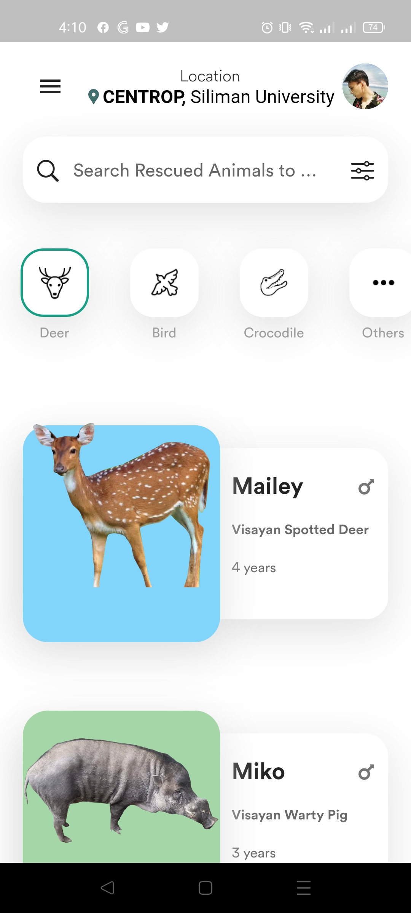
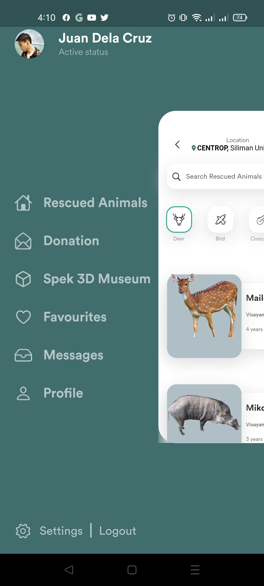
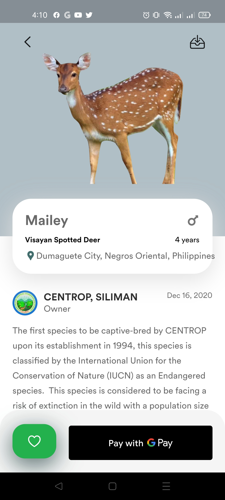
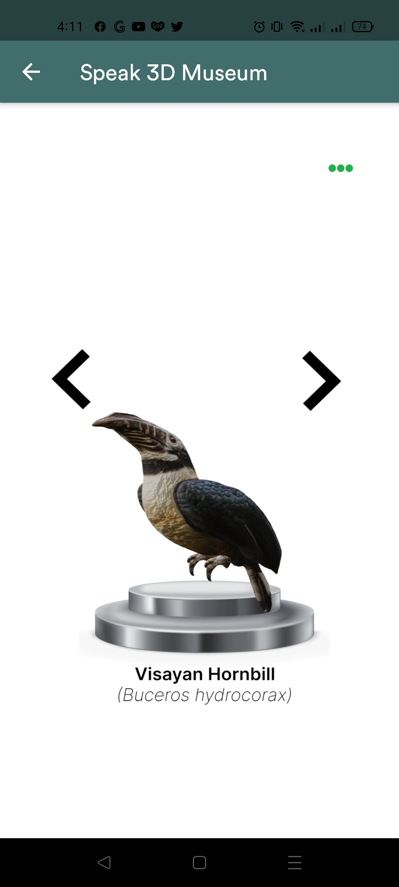
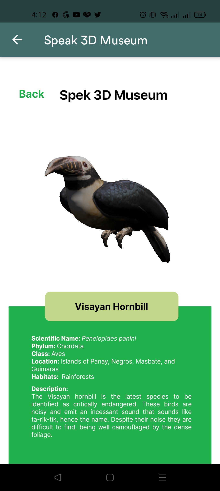
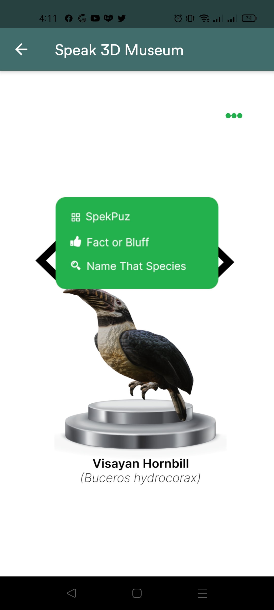
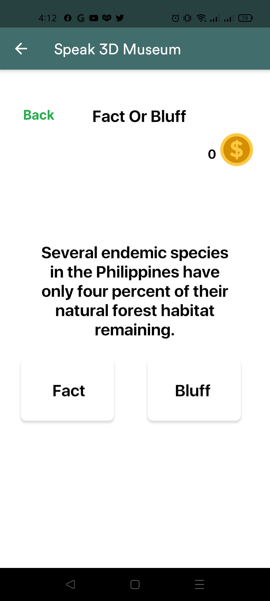
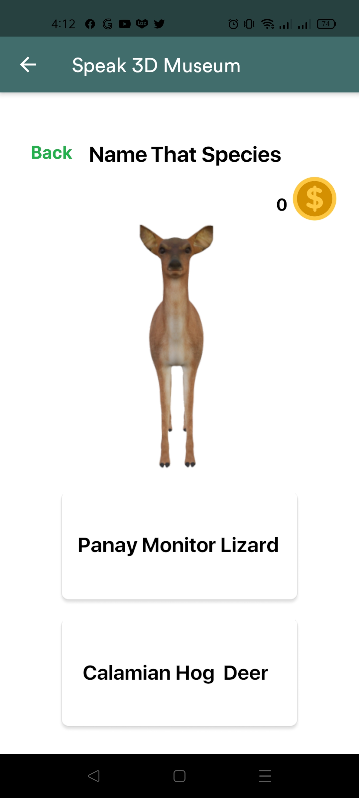

# Accenture Program the Future 2021 Entry

A mobile application that supports the conservation of Philippine endangered species through featuring the wildlife stories with their 3D models and fun educational games for children, aiming to provide funding and donations.

## About

Unity and Flutter integration, With Google Pay Service
## Preview

Screenshots from the app:

</img>
</img>
</img>
</img>
</img>
</img>
</img>
</img>
</img>

